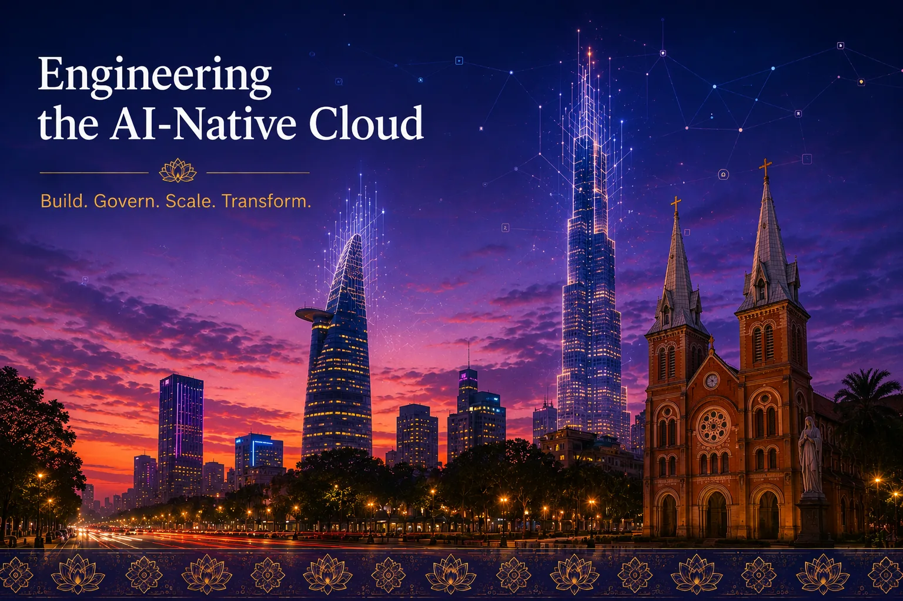
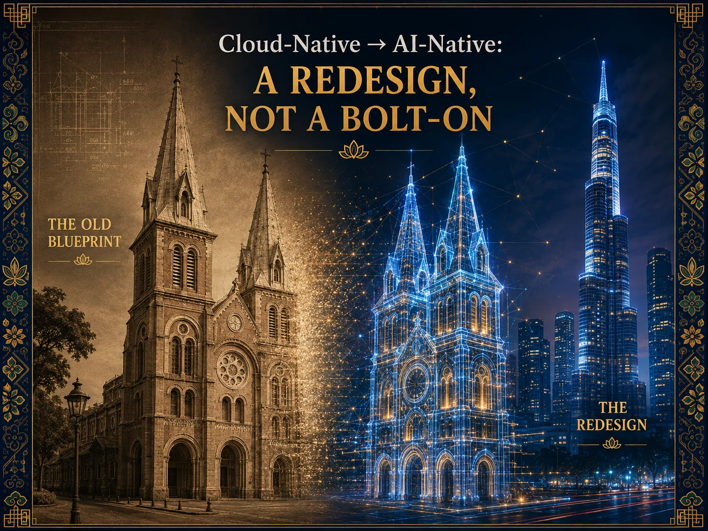
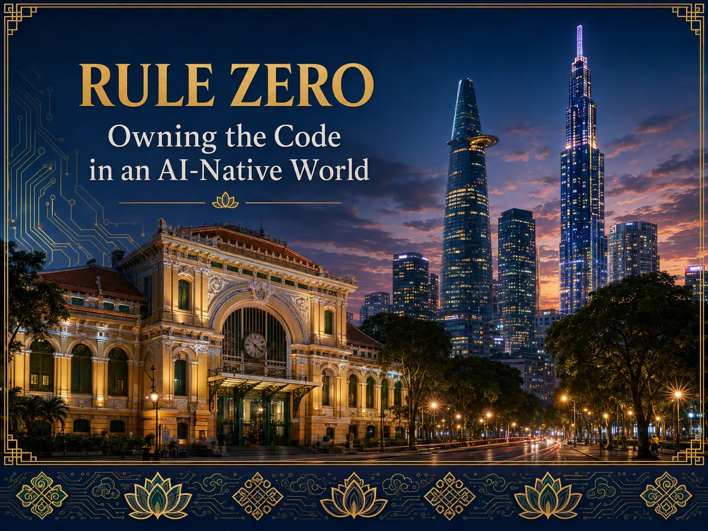
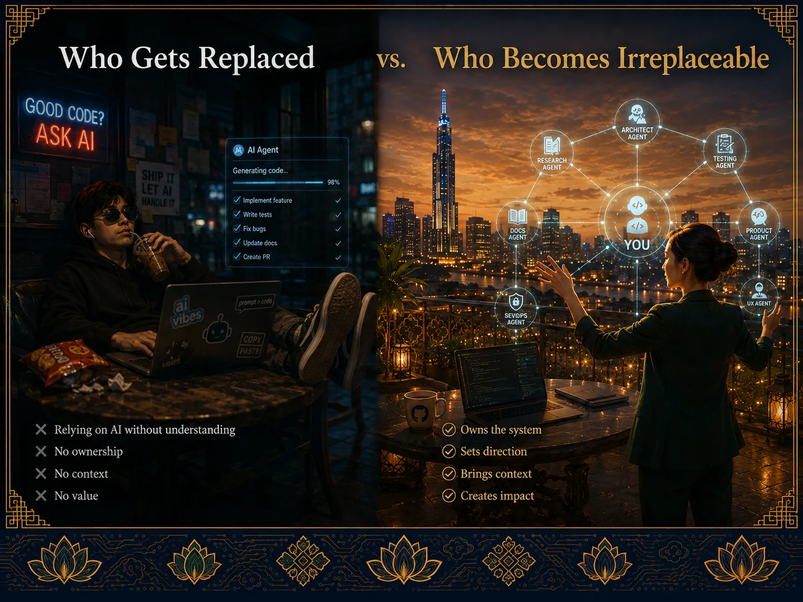
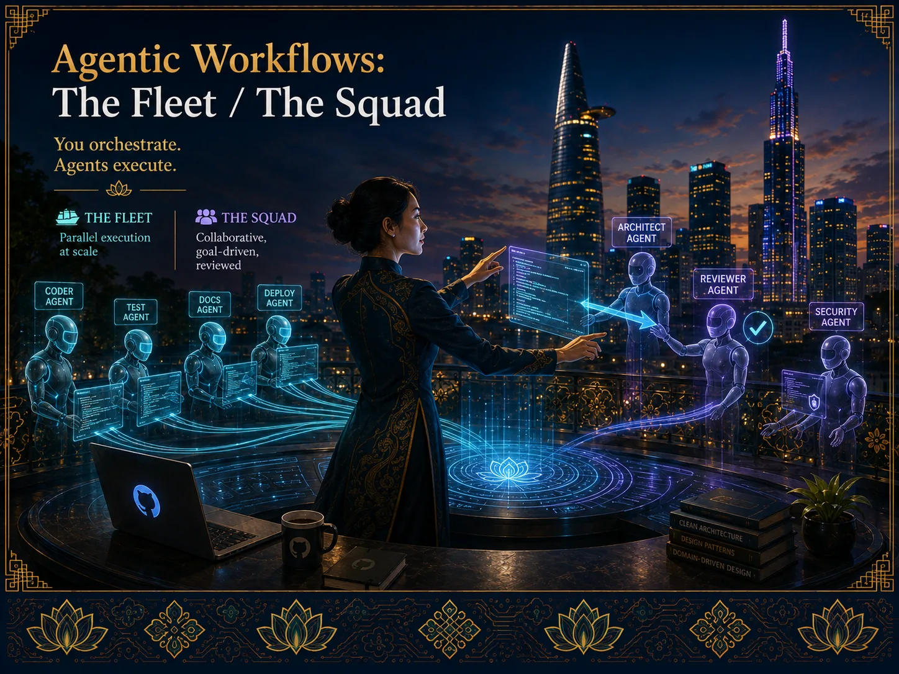
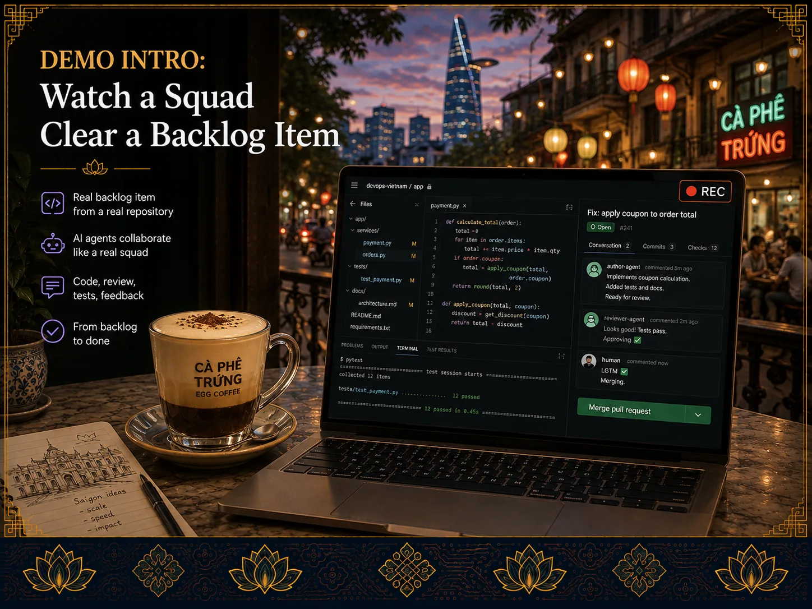
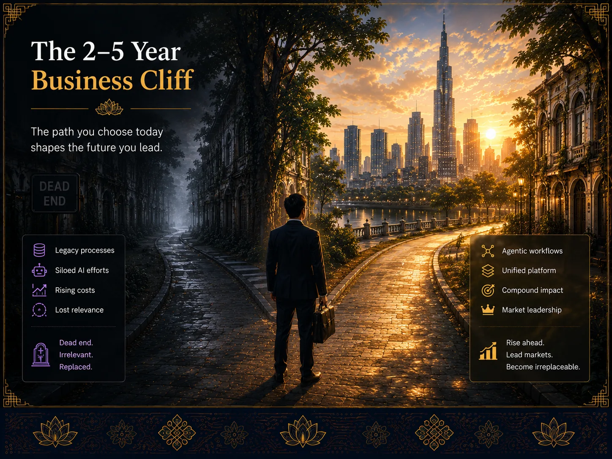
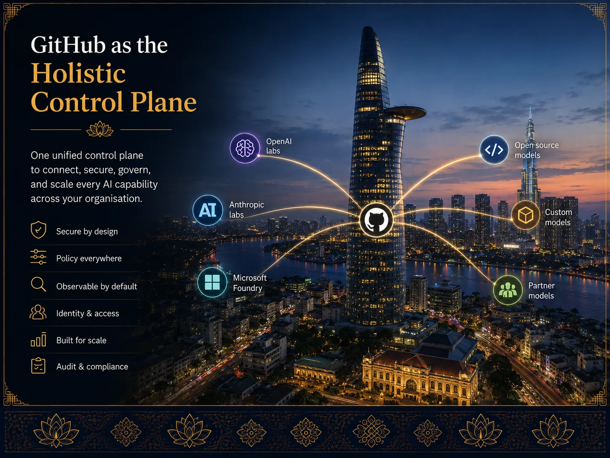
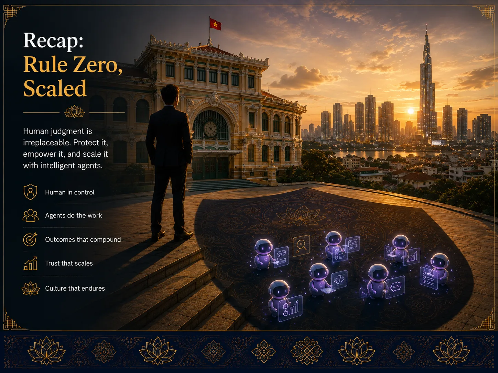
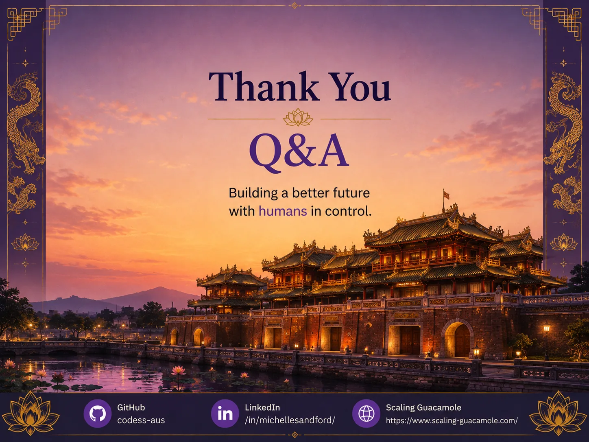

# Engineering the AI-Native Cloud

  

**Cloud Native AI in the SDLC.** This is the companion site for a DevOps Asia Conference talk about what
changes — and what doesn't — when AI agents join the software delivery lifecycle. It is built for engineers,
tech leads and platform teams who already run cloud-native pipelines and now need to fold agentic AI,
GitHub Copilot, and multi-agent review into that same discipline: version control, code review, CI/CD,
governance and audit.

The talk's core argument is simple: **AI-native is a redesign of your SDLC, not a plugin bolted onto it.**
Every chapter below expands one beat of the talk into something you can actually apply on Monday morning —
with links back to primary GitHub and Microsoft documentation so you can go deeper than the slide.

!!! note "How this site is organised"
    Each chapter opens with the original hero slide from the talk, followed by the expanded technical
    content. Use the **Next**/**Previous** links at the bottom of each page to move through the talk in
    order, or jump straight to a topic from the grid below. A [Resources](resources.md) page collects every
    external link in one place.

## Chapters

<ul class="chapter-grid">
  <li class="chapter-card">
    <a class="chapter-card__link" href="chapters/01-redesign/" style="display:contents;">
      
      
        Chapter 1
        A Redesign, Not a Bolt-On
        Why "cloud-native" principles need re-deriving for an AI-native SDLC, not just an AI feature bolted on top.
        Read chapter →
      
    </a>
  </li>
  <li class="chapter-card">
    <a class="chapter-card__link" href="chapters/02-rule-zero/" style="display:contents;">
      
      
        Chapter 2
        Rule Zero: You Own the Code
        The one non-negotiable rule of agentic engineering — and why it doesn't change no matter how autonomous the tooling gets.
        Read chapter →
      
    </a>
  </li>
  <li class="chapter-card">
    <a class="chapter-card__link" href="chapters/03-accountability/" style="display:contents;">
      
      
        Chapter 3
        Rule Zero in Practice: Accountability
        What "approve the pull request" actually means when the diff was written by an agent — and how to design that gate.
        Read chapter →
      
    </a>
  </li>
  <li class="chapter-card">
    <a class="chapter-card__link" href="chapters/04-replaceable/" style="display:contents;">
      
      
        Chapter 4
        Who Gets Replaced, Who Becomes Irreplaceable
        The tasks agents absorb, and the judgement skills that compound in value once they do.
        Read chapter →
      
    </a>
  </li>
  <li class="chapter-card">
    <a class="chapter-card__link" href="chapters/05-fleet-squad/" style="display:contents;">
      
      
        Chapter 5
        Agentic Workflows: The Fleet and The Squad
        Two operating models for orchestrating multiple agents — parallel fleets and reviewed squads — and when to use each.
        Read chapter →
      
    </a>
  </li>
  <li class="chapter-card">
    <a class="chapter-card__link" href="chapters/06-backlog/" style="display:contents;">
      
      
        Chapter 6
        The Backlog Has No Bottom
        Triage patterns for handing low-risk backlog items to agents, and keeping a human accountable for the queue.
        Read chapter →
      
    </a>
  </li>
  <li class="chapter-card">
    <a class="chapter-card__link" href="chapters/07-demo/" style="display:contents;">
      
      
        Chapter 7
        The Demo: A Squad Clears a Backlog Item
        Walking through an assign → code → review → merge loop using GitHub Copilot's coding agent and a reviewer agent.
        Read chapter →
      
    </a>
  </li>
  <li class="chapter-card">
    <a class="chapter-card__link" href="chapters/08-business-cliff/" style="display:contents;">
      
      
        Chapter 8
        The 2–5 Year Business Cliff
        Why the constraint shifts from "which two projects do we fund" to "can we govern all ten at once."
        Read chapter →
      
    </a>
  </li>
  <li class="chapter-card">
    <a class="chapter-card__link" href="chapters/09-control-plane/" style="display:contents;">
      
      
        Chapter 9
        GitHub as the Holistic Control Plane
        Model-agnostic governance: identity, policy, audit and observability for every agent, regardless of which model powers it.
        Read chapter →
      
    </a>
  </li>
  <li class="chapter-card">
    <a class="chapter-card__link" href="chapters/10-recap/" style="display:contents;">
      
      
        Chapter 10
        Recap: Rule Zero, Scaled
        Bringing it together — judgement as the multiplier, governance as the guardrail, at fleet scale.
        Read chapter →
      
    </a>
  </li>
  <li class="chapter-card">
    <a class="chapter-card__link" href="resources/" style="display:contents;">
      
      
        Resources
        Go Further
        Awesome Copilot, agentic workflows on GitHub, Git-Ape, and every reference used across this site.
        Open resources →
      
    </a>
  </li>
</ul>

## About this talk

"Engineering the AI-Native Cloud" looks at cloud native AI in the SDLC through a DevOps lens: Azure DevOps
and GitHub as the system of record, agentic workflows and multi-agent review as the new unit of work, and
GitHub Copilot as the control plane that keeps all of it governed, auditable, and accountable to a human.
No case studies or statistics on this site are invented — where a number or example is used, it links to
its primary source on Microsoft Learn, GitHub Docs, or the GitHub Blog.
